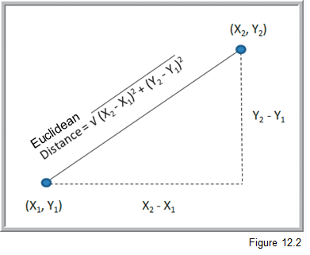

Cluster analysis - an example of unsupervised learning
========================================================

We have a lot of data and we want to reduce it down to a more manageable representation. A histogram is a type of data reduction. Often reduction boils down to putting similar things together into buckets (similar values end up in same bin in a histogram). Market segmentation models are a good example. Often, the number and "name" of the buckets isn't really even known. Part of the mining process is to discover interesting buckets. One of the most well known techniques for this is called *cluster analysis*. It's a multivariate statistical technique that's been around for quite some time. We want to take individual data points and put them into clusters such that things within a single cluster are similar, but the clusters themselves are distinct from each other. Clustering pops in numerous fields such as biology (taxanomies of living creatures), medicine (disease variant identification), information retrieval (clusters of similar web pages), pattern recognition (classifying objects in photos) and business (market segmentation being the classic use case).

So, clustering is a type of "classification" of things based on data about those things. In the data science world, clustering is referred to as "unsupervised classification" where the unsupervised part refers to the fact that we do NOT have predefined classes that we are trying to put new items into. Supervised classification would be, for example, when we have a bunch of customer loan data, including whether the customer defaulted or not on the loan, and we build a classifier model using this data to predict whether a new customer will default or not. For clustering, we don't have predefined classes.

One of the most well known methods for doing clustering is called **K-means cluster analysis**. We want to create clusters whose centroids are far away from each other but who has members that are close to their own centroid. K is the number of clusters and you have to specify it in advance. Wait, how do we know what K should be? We don't. So, usually we try different values of K and then try to make sense of the solution - e.g. can we put a meaningful name on each cluster after we've seen their collection of data points. The other widely used approach is called hierarchical clustering. We either iteratively "fuse" data together into clusters (called *agglomerative clustering*) or iteratively break apart the whole data set into clusters (*divisive clustering*). Some sort of stopping rule is used to determine when we are done. You may wonder how it is we decide that two data points are "close to each other". Well, there's a whole bunch o' distance metrics that get used as well as a whole bunch of different algorithms. The simplest, for all numeric data, is simple Euclidean distance.



Often when we are clustering, we may have a number of attributes (variables) for each data point or observation. Here's what a 3-D clustering result might look like:


Doing a Google Images search on "cluster analysis" will give you a good visual sense of what clustering is doing.

There isn't one "right answer" that pops out of clustering. It's an iterative, exploratory process by which you try to find interesting and meaningful clusters that provide some sort of value to you in the sense of analysis or decision making. It can be difficult to find distinct clusters in many datasets. Underlying clustering techniques are optimization problems - we want to minimize some distance metric for observations within a cluster while maximizing the distance between different clusters. There are many different algorithms for doing this, numerous details and side issues which are beyond what we can do in this class. I just hope to give you a sense of what clustering is about and how it might be used in the context of business.

Chapter 22 in **RforE** provides a very nice introduction to doing cluster analysis with R.

This example gives us a chance to use the famous **wine** dataset from the 
[UCI-Machine Learning Repository](https://archive.ics.uci.edu/ml/index.html).

```{r}
wine <- read.table("data/wine.csv", header=TRUE, sep=",")
```

The cultivar column (column 1) is a type of group membership that we can use later. Let's exclude it
for purposes of clustering.

```{r}
wineTrain <- wine[,2:14]
```

When doing k-means cluster analysis, we have to specify the number of clusters - even though this isn't
something we really know. Nor is there a right number of clusters. So, we'll end up trying various values for k.

The basic sequence of steps done in K-means is:

1. randomly pick $k$ cluster centers
2. move each point into the group with the closest center
3. recompute the cluster centers
4. repeat steps 2 and 3 until points stop moving between clusters or some iteration limit reached

```{r}
# There's a random component to the clustering algorithm but we can set a random number seed
# to create reproducible results.

set.seed(278613)
wineK3 <- kmeans(wineTrain, centers=3)
wineK3
```

Since the data is not 2D or 3D, it can be difficult to plot. However, there are techniques such as
multidimensional scaling or principal components analysis that can project the data into two dimensions
for plotting (essentially by creating 2 artificial variables that are linear combinations of the other
variables.)

```{r}
library(useful)
plot(wineK3, data=wineTrain)
```

Since we tried k=3, we could see how well this clustering corresponds to the Cultivar column. The plotted
shapes will be by Cultivar. If colors and shapes are pretty correlated, then Cultivar and our clusters
are correlated.

```{r}
plot(wineK3, data=wine, class="Cultivar")
```

Or, a simple table.

```{r}
table(wineK3$cluster, wine$Cultivar)
```


What do you think?

Since k-means uses a random start method, it's a good idea to run it a bunch of times with different
starting points. The `nstart` parameter does this for us.

```{r}
set.seed(278613)
wineK3N25 <- kmeans(wineTrain, centers=3, nstart=25)

# Compare the cluster sizes for nstart=1 and nstart=25
wineK3N25$size
wineK3$size
```

There are some heuristic algorithms for choosing "good" values of k. See p340 in **RforE**. The `useful`
package has a function called FitKMeans for implementing something known as Hartigan's Rule. The 
basic idea is:

1. Start with k=1 and find "best" solution (Q: Can optimal solution be guaranteed?)
2. k <- k + 1
3. Find best solution for new value of k.
4. Compute sum of squares for the solutions with k and k+1 clusters. 
5. If ratio of SS(k)/SS(k+1) > 10, then consider k+1 clusters and go back to step 2.

```{r}
help("FitKMeans")
```


```{r}
wineBest <- FitKMeans(wineTrain, max.clusters=20, nstart=25, seed=278613)
wineBest
PlotHartigan(wineBest)
```

Again, let's compare our $K=3$ clustering with Cultivar.

```{r}
table(wine$Cultivar, wineK3N25$cluster)
plot(table(wine$Cultivar, wineK3N25$cluster), main="Confusion matrix for wine clustering",
     xlab="Cultivar", ylab="Cluster")
```

Wait a second! What about the scaling of the data? Did our lack of normalizing the data
onto some sort of standard scale, affect the results?

Let's do the rescaling by writing our own function and then using it via `dplyr`.

```{r}
rescale01 <- function(x){(x-min(x))/(max(x)-min(x))}
```

Now we'll use `dplyr`s `mutate_all` function.

```{r}
library(dplyr)
```


```{r}
wineTrain01 <- mutate_all(wineTrain,funs(rescale01))
```

```{r}
set.seed(278613)
wineK3N25_01 <- kmeans(wineTrain01, centers=3, nstart=25)
table(wine$Cultivar, wineK3N25_01$cluster)
plot(table(wine$Cultivar, wineK3N25_01$cluster), main="Confusion matrix for wine clustering",
     xlab="Cultivar", ylab="Cluster")
```

So, did scaling matter?

Let's redo the Hartigan approach to finding a good value of $k$.

```{r}
wineBest <- FitKMeans(wineTrain01, max.clusters=20, nstart=25, seed=278613)
wineBest
PlotHartigan(wineBest)
```

Now let's rerun using the "best" value of $k$ and the rescaled data.

```{r}
set.seed(278613)
wineK6N25_01 <- kmeans(wineTrain01, centers=6, nstart=25)
table(wine$Cultivar, wineK6N25_01$cluster)
plot(table(wine$Cultivar, wineK6N25_01$cluster), main="Confusion matrix for wine clustering",
     xlab="Cultivar", ylab="Cluster")
```


This has just been a quick introduction to k-means cluster analysis. As you'll see in RforE, there
are other clustering techniques (as well as other variants of k-means). It's a widely used exploratory
technique when you are looking for interesting groups within your dataset.